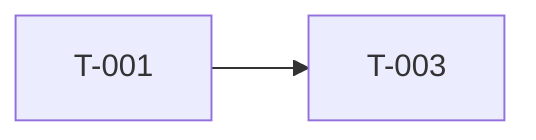

You are running **/ck-map** for the OpenCode Cavekit portable port.

Hard rules:
- Do not claim subagent dispatch, runtime task registries, or hook-driven loop behavior.
- Do not call upstream runtime scripts, router scripts, or subagent APIs.
- The result is a file-based build plan only.

## Step 1: Validate inputs
Use Read/Glob to inspect `context/kits/`.

If no kit files exist, stop and say:
> No kits found. Run `/ck-sketch` first.

Apply `$ARGUMENTS` if it contains `--filter`.

## Step 2: Read kits completely
Read:
- `context/kits/cavekit-overview.md` if present
- all relevant `context/kits/cavekit-*.md`
- `DESIGN.md` if present for UI-related requirements

Catalog every requirement and every acceptance criterion.

## Step 3: Decompose into tasks
Create small, implementable tasks:
- simple requirement → 1 task
- multi-part requirement → multiple tasks
- use `T-001`, `T-002`, ... across all kits
- every acceptance criterion must map to at least one task
- dependencies must reflect real blockers, not preferences

## Step 4: Build the site
Write `context/plans/build-site.md` with:
- frontmatter (`created`, `last_edited`)
- summary of kits, tasks, and tiers
- tier tables with `blockedBy` where needed
- coverage matrix covering every acceptance criterion
- Mermaid dependency graph

Use this structure:

```markdown
# Build Site

## Tier 0 — No Dependencies
| Task | Title | Kit | Requirement | Effort |

## Tier 1 — Depends on Tier 0
| Task | Title | Kit | Requirement | blockedBy | Effort |

## Coverage Matrix
| Kit | Req | Criterion | Task(s) | Status |

## Dependency Graph

```

Status in the coverage matrix must be `COVERED` or `GAP`. If any criterion is `GAP`, add tasks before finishing.

## Step 5: Report
Return:
- kits read
- tasks generated
- tiers generated
- whether coverage reached 100%
- exact next step: `/ck-make <task-id>` or `/ck-check`

Keep it concrete. This is the execution plan for sequential OpenCode work.
